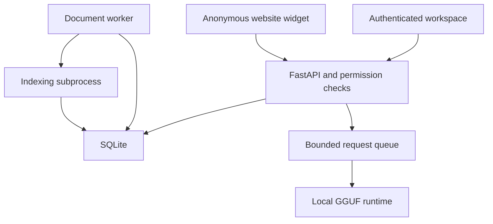

# Architecture

Nelsonict AI 1.2 is a single-host application with a FastAPI server, self-contained browser interface, local GGUF inference, SQLite storage and one document worker. No separate vector database, Redis, frontend build service or external AI API is required.

## Runtime responsibilities

| Component | Responsibility |
|---|---|
| Browser workspace | Authenticated chat, document management, model/settings forms, evaluation and operations controls. |
| FastAPI process | Authentication, permission checks, API/static assets, request admission and streaming. |
| Model runtime | Holds one llama-cpp-python model and serialises model operations/generation. |
| Request scheduler | Bounded FIFO admission for private chat, evaluation and public requests. |
| Document worker | Claims durable processing jobs, tracks heartbeat and launches an indexing subprocess per document. |
| Indexing subprocess | Validates/extracts text, optionally performs OCR/embedding, and publishes passages atomically. |
| SQLite | Accounts, sessions, originals, passages, vectors, conversations, settings and feature records. |
| Desktop/CLI supervisor | Starts and stops API/worker; reads restart-time migration settings for managed launch. |

One API process and one worker operate per data directory. File locks reject duplicate instances. Running several Uvicorn workers would create competing model runtimes and is unsupported. Keep SQLite on persistent local storage rather than an NFS/SMB share.

## Private chat lifecycle

1. Authenticate the session and check CSRF/client headers on the mutation.
2. Verify ownership of the conversation and access to the selected knowledge base/documents.
3. Admit a bounded queue ticket and save the user message plus an in-progress assistant record.
4. Wait for FIFO position and the model lock, reporting waiting position through the SSE stream.
5. Recheck account/conversation/knowledge access when execution begins.
6. Retrieve evidence or build the general-chat prompt, budget context and stream the local response.
7. Save content, sources and final state, release the model and remove the ticket.

Cancellation removes waiting tickets immediately. Active generation observes its stop event between native steps. Stopping the API interrupts in-memory requests; startup marks unfinished private messages and evaluation runs as interrupted. The document-processing queue is durable and follows a different recovery path.

## Document pipeline and retrieval

Original bytes and a SHA-256 checksum are stored in SQLite. The historical `documents.pdf` BLOB column holds all supported original formats; the `format` column identifies the type.

The worker claims a queued document transactionally and starts a bounded indexing subprocess. Text extraction is format-specific. PDF OCR is attempted on low-text pages when dependencies are installed. The indexer chunks extracted text and optionally computes normalised embeddings, then publishes passages in one transaction after the job succeeds.

Keyword retrieval uses SQLite FTS5. Optional semantic retrieval uses a local Sentence Transformers directory, float32 vectors stored in SQLite, and a model fingerprint. Candidate selection is scoped to accessible, ready documents before scoring. The default hybrid result combines keyword and semantic ranking and returns up to five passages within the model's context budget.

Full summary/comparison instead reads every passage from the selected ready documents and uses multiple model calls to combine intermediate notes. Passage, document-count, context and time limits bound this work. It is document analysis, not model fine-tuning.

## Database map

| Tables | Stored data |
|---|---|
| `users`, `sessions`, `login_attempts` | Account hashes, session records and rate-limit counters. |
| `knowledge_bases`, `knowledge_members` | Collection ownership and explicit reader/editor membership. |
| `documents`, `chunks`, `chunks_fts` | Original files, processing state, source text/location, optional vectors and keyword index. |
| `assistants`, `conversations`, `messages` | Personal instructions, conversation history, source snapshots and reply states. |
| `settings`, `model_profiles` | Runtime preferences, wizard/worker metadata and saved model configurations. |
| `feedback` | Explicitly submitted answer ratings and notes. |
| `eval_questions`, `eval_runs` | Personal reference questions and saved evaluation results/reviews. |
| `public_sites`, `public_documents` | Public-assistant configuration and explicit document/checksum approvals. |

SQLite uses WAL, foreign keys and transactions. Schema versions 1 and 2 migrate to 3 during startup. The backup archive's format version remains 1; do not confuse it with the database schema or application version.

## Migration and restart boundary

A GUI restore creates `restores/<id>/data` under the original bootstrap data directory. It validates and sanitises a snapshot without replacing the live database. Reviewed activation writes `runtime-settings.json` at that bootstrap root. Newly started API/worker processes read the same overlay; already running processes retain their original settings until restart.

`previous-runtime-settings.json` records the prior effective settings for manual rollback. Keep the bootstrap directory accessible after migration. The overlay is an external file, not part of the SQLite backup. Deployment-manager settings such as container port publishing, systemd command-line flags, DNS and firewall rules remain outside this overlay.

## Public/private boundary

A public assistant creates a separate collection. The owner approves individual ready document IDs and original-file checksums; no private collection is used as a retrieval fallback. Public retrieval passes only those approved IDs to the normal scoped search.

The widget is an iframe served by the AI host and calls same-origin anonymous endpoints with cookies omitted. Its response permits framing only by configured HTTPS origins. The private workspace retains framing protection. Browser embedding restrictions do not authenticate a public API: approved information must be suitable for anyone to read.

Public answers and questions are not stored as conversation history. Temporary execution data exists in memory and rate-limit metadata in SQLite. Publication changes cancel outstanding site requests cooperatively. Restore disables public publication pending review.

## Feedback and evaluation boundary

An answer owner explicitly consents to sharing its content and source excerpts when submitting feedback. Administrators can inspect submitted reports, but this does not grant access to all conversations.

Evaluation questions/runs belong to their creator and require current collection access at execution. Results retain question/reference snapshots, generated answers, evidence and model configuration. A model SHA-256 is recorded when its file is available. Expected-term coverage is a lexical diagnostic; human pass/fail review is separate.

## Security and operational limits

The app uses Argon2 password hashing, HTTP-only sessions, SameSite cookies, CSRF checks, host/origin checks and account/collection permission checks. HTTPS and secure cookies must be configured for public deployments. Data and backups are not encrypted by the application; the host administrator can access them.

Source passages are untrusted prompt context. Instructions reduce but cannot eliminate prompt injection or hallucinations. The model has no shell/browser/file tools. Queue limits, archive limits and indexing timeouts do not replace OS-level memory limits or public traffic controls.

This architecture targets one host and bounded collections/user load. It does not implement horizontal scaling, tenant-isolated model pools, SSO, billing, a durable chat queue, or automatic model downloads. Use the [acceptance checklist](ACCEPTANCE.md) to measure your target setup.
